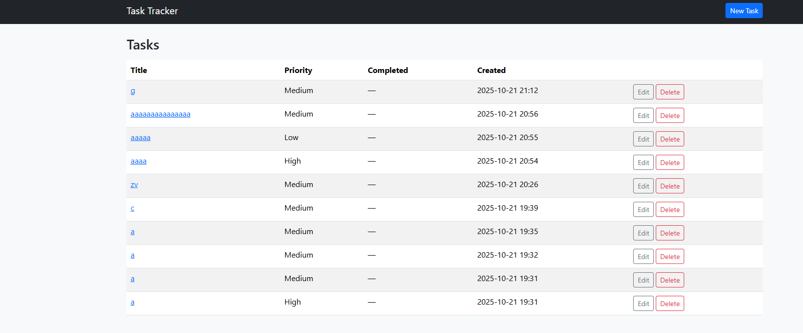
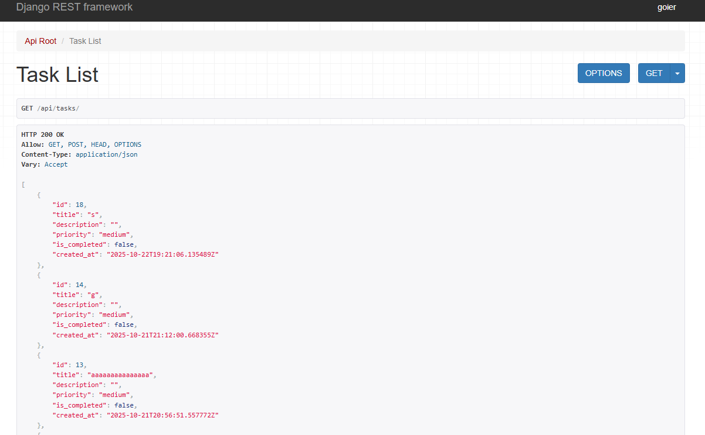

# 📝 Task Tracker — Django Challenge

## 🧩 Descripción
**Task Tracker** es una aplicación desarrollada con **Django** para gestionar tareas (To-Do List).  
Permite crear, visualizar, editar y eliminar tareas mediante una interfaz web y también a través de una **API REST** desarrollada con **Django REST Framework**.

El proyecto implementa:
- CRUD completo para el modelo `Task`  
- Validaciones del lado del servidor con formularios (`TaskForm`)  
- Mensajes de confirmación en operaciones exitosas  
- Diseño responsivo con Bootstrap  
- API REST funcional para operaciones CRUD en JSON  
- Buenas prácticas de Git (Conventional Commits y Trunk-Based Development)

---

## ⚙️ Requisitos previos
- **Python 3.10+**  
- **Pip** y **virtualenv** instalados  
- **Git**  
---

## 🚀 Instalación y configuración

```bash
# 1️⃣ Clonar el repositorio
git clone https://github.com/GoierBachus1/django-challenge.git
cd django-challenge

# 2️⃣ Crear entorno virtual e instalar dependencias
python -m venv .venv
.\.venv\Scripts\Activate.ps1   
pip install -r requirements.txt

# 3️⃣ Aplicar migraciones
python manage.py makemigrations
python manage.py migrate

# 4️⃣ Crear superusuario (opcional, para panel admin)
python manage.py createsuperuser

# 5️⃣ Ejecutar el servidor
python manage.py runserver
```

Abrir en el navegador:  
👉 [http://127.0.0.1:8000/tasks/](http://127.0.0.1:8000/tasks/)

---

## 🧱 Estructura del proyecto

```text
project/
│
├── project/               # Configuración principal de Django
├── tasks/                 # Aplicación principal
│   ├── models.py          # Modelo Task
│   ├── views.py           # Vistas CRUD
│   ├── forms.py           # Validaciones con ModelForm
│   ├── urls.py            # Rutas web y API
│   ├── templates/         # Templates HTML
│   └── api.py             # API REST (DRF)
│
├── manage.py
└── requirements.txt
```

---

## 🌐 Endpoints principales

### 🖥️ Web CRUD
| Acción | Método | URL |
|--------|---------|------|
| Listar tareas | GET | `/tasks/` |
| Crear tarea | GET / POST | `/tasks/new/` |
| Ver detalle | GET | `/tasks/<id>/` |
| Editar | GET / POST | `/tasks/<id>/edit/` |
| Eliminar | GET / POST | `/tasks/<id>/delete/` |

### Task List

### Task Form (Create/Edit)


### Task Detail


### Confirm Delete


### Django Admin (custom logo + theme)


### API (DRF) – /api/tasks/


### 🧠 API REST (Django REST Framework)
| Acción | Método | URL |
|--------|---------|------|
| Listar tareas | GET | `/api/tasks/` |
| Crear tarea | POST | `/api/tasks/` |
| Detalle | GET | `/api/tasks/<id>/` |
| Actualizar | PUT / PATCH | `/api/tasks/<id>/` |
| Eliminar | DELETE | `/api/tasks/<id>/` |

Ejemplo de respuesta JSON:
```json
{
  "id": 1,
  "title": "Task 1",
  "description": "This the task 1",
  "priority": "low",
  "is_completed": false,
  "created_at": "2025-10-21T14:00:00Z"
}
```

---

## ✅ Validaciones
- `title` requerido (`CharField(max_length=100)`)  
- `priority` debe ser uno de: `low`, `medium`, `high`  
- Validación de longitud y espacios en blanco en `TaskForm`  
- Mensajes de error visibles en el formulario  

---

## 🧠 Convenciones de commits
Este proyecto utiliza el estándar [**Conventional Commits**](https://www.conventionalcommits.org/en/v1.0.0/) para mantener un historial legible y semántico.

Ejemplos:
```
feat(tasks): add Task model and CRUD views
fix(routes): remove extra space in task_list URL name
chore(git): add .gitignore and remove .venv from repo
```

**Flujo de trabajo:** *Trunk-Based Development*  
- Todos los cambios se integran a la rama `main` en pequeños commits.  
- Versionado semántico manual (`v0.1.0`, `v0.2.0`, … `v1.0.0`).

---

## 💬 Notas finales
Este proyecto fue desarrollado como parte del desafío técnico **“Django Challenge”**.  
Implementa todos los criterios de evaluación:  
- CRUD funcional  
- Buenas prácticas de código y git  
- Validaciones y mensajes  
- Templates estructurados  
- API REST   

---

